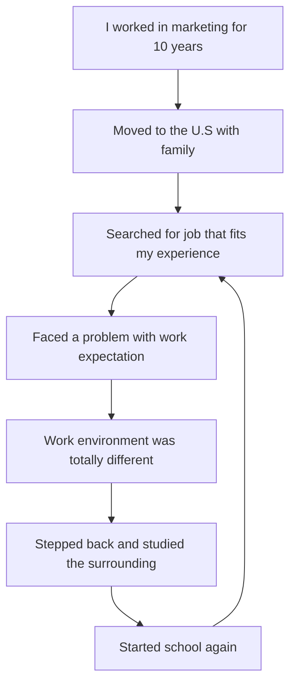

### Documentation
This Flowchart describes my last years of my career. It begins with describing my secure life and career. Then, my life faced a turning point when I moved to the U.S. and started looking for jobs. I found jobs environment is different and the companies didn’t care about my long experience. Thus, I thought a lot and I discussed the situation with people surrounding me. So, I faced my situation and took the decision to improve my self with another certificate to enable me to compatible in my job search.
Since, I begin from the first step, every next step led to the other and this is significantly positive.

 
 

